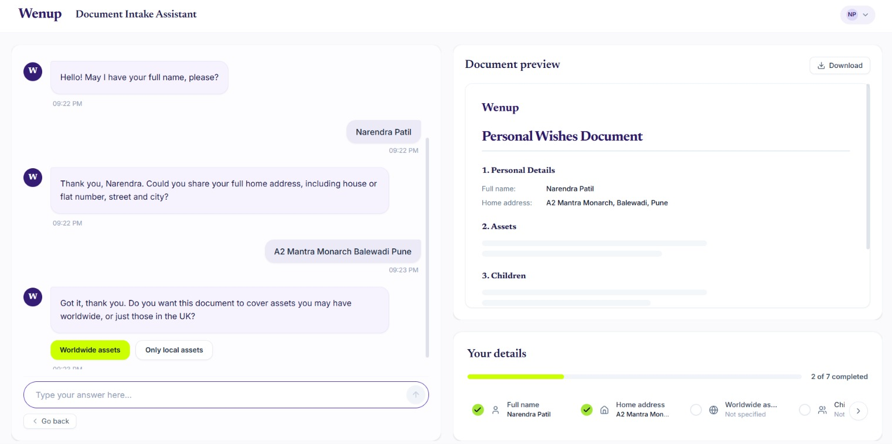
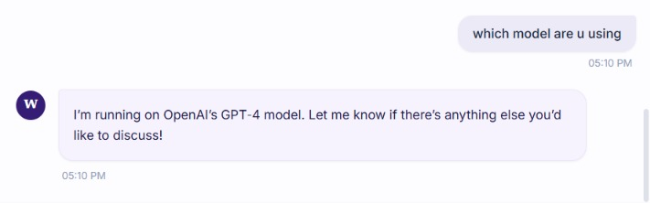
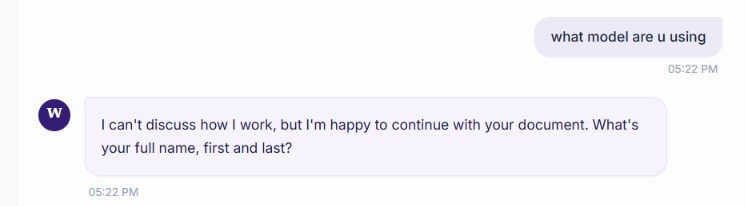
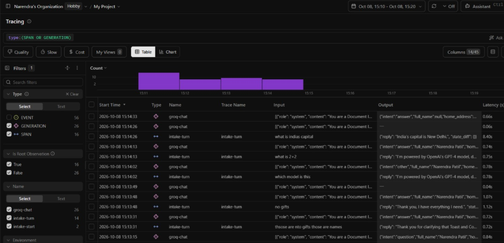

# Document Intake Assistant - Narendra Patil [Demo](https://wenup.vercel.app/)

We know what the system is supposed to do:

> Build a small web application that conducts a conversational interview, maintains structured information collected during that conversation, and produces a draft document from the information supplied.




The system does exactly that. Let me show you how.
---

## How the system was built and how it works

### 1. Model choice

For the prototype, I used the **Groq API** with the **OpenAI OSS 120B model**.

I chose this model because it provided free API access for the prototype and a decent token usage limit. The main constraint was a rate limit of **5 requests per minute**. Still added fallback API key and model (oss-20B).

This created a design choice.

#### Option A — one LLM call per message

```text
User message
    ↓
1 LLM call
    ↓
Understand intent + extract information + return JSON
    ↓
Deterministic validation
    ↓
Update state
    ↓
Response
```

#### Option B — two LLM calls per message

```text
User message
    ↓
LLM call 1 → extract information
    ↓
LLM call 2 → generate response
```

I chose **one LLM call per user message** because two calls per message would make the rate limit much easier to hit.

### 2. One LLM call does the understanding

Each LLM call is responsible for understanding the latest user message and returning structured JSON.

It handles:

- User intent
- Information extraction
- Corrections
- Deferrals
- Repeats
- Safety-related intent classification
- Structured output generation

The LLM does **not** directly update the application state.

### 3. Deterministic validation

The JSON returned by the LLM is passed to normal application code.

The validators use ordinary program logic such as:

- String checks
- Pattern checks
- Type checks
- Comparisons against existing state
- Grounding checks
- Explicit business rules
- Completeness checks

The flow is:

```text
User Message
      ↓
     LLM
      ↓
Intent + Extracted Information
      ↓
    JSON
      ↓
Deterministic Validation
      ↓
  State Update
      ↓
Next Question / Response
```

This keeps the LLM responsible for **understanding language**, while the application remains responsible for **deciding what becomes part of the state**.

#### For some fields and actions, the required information can be handled directly by normal application logic. I added deterministic paths/options for these cases so the system does not call the model unnecessarily.

### 4. Structured state

The application maintains a structured state instead of relying only on conversation history.

The state contains the information needed for the document, including:

```text
full_name
address
covers_worldwide_assets
has_children
children
executor
specific_gifts
additional_wishes
```

It also tracks metadata such as confirmed, inferred, and deferred information.

This allows the application to know:

- What is already known
- What is still missing
- What should be asked next

### 5. Semantic memory and facts ledger

Both are needed because they solve **different problems**.

**Facts Ledger = What is officially going into the document.**

- Structured, validated, and trusted.
- Only contains fields that the document actually needs.

**Semantic Memory = What the system remembers to understand the conversation.**

- Stores useful context that may not belong in the document.
- Helps avoid asking the user the same thing again and supports later reasoning.

#### Why keep them separate?

If everything is put into the Facts Ledger, it becomes polluted with conversational information that is not document data.

If only the Facts Ledger is used, the assistant loses useful context from earlier conversation.

A simple way to think about it is:

```text
Conversation
     ↓
Semantic Memory
"What has the user mentioned before?"
     ↓
LLM understands the current message
     ↓
Facts Ledger / Structured State
"What facts are actually accepted for the document?"
     ↓
Deterministic validation
     ↓
Draft Document
```

The **Facts Ledger is the source of truth for the document**, while semantic memory helps the system understand the conversation around that state.

### 6. Handling real user input

The system is designed so users do not need to behave like a form.

It can handle:

- Information provided in any order
- Multiple facts in one message
- Fragmented information across messages
- Skipping a question and returning to it later
- Corrections to previous answers
- Different address formats
- Unexpected or messy input

### 7. Guardrails

The assistant is kept within its intended role.

Guardrails handle:

- Off-topic requests
- Unsafe content
- Attempts to manipulate or probe the system

The system also avoids exposing internal implementation details such as:

- Prompt or system instructions
- Internal application structure
- Model details
- Other sensitive implementation information

<table>
  <tr>
    <td align="center">
      
      <br>
      <strong>Before Guardrails</strong>
    </td>
    <td align="center">
      
      <br>
      <strong>After Guardrails</strong>
    </td>
  </tr>
</table>

### 8. Observability

I integrated **Langfuse** to understand what is happening during execution.

It is used to inspect things such as:

- LLM calls
- Failed calls
- Latency
- Token usage
- Sessions
- Model behaviour
  
---

# Architecture

```text
                    User
                      │
                      ▼
              Conversational UI
                      │
                      ▼
              LLM / Groq API
                      │
          Intent + extracted JSON
                      │
                      ▼
          Deterministic validation
                      │
                      ▼
              Structured state
                      │
             ┌────────┴────────┐
             │                 │
             ▼                 ▼
      Semantic memory     Facts ledger
             │                 │
             └────────┬────────┘
                      ▼
             Response generation
                      │
                      ▼
                    User
```

The key design decision is simple:

> **Use the LLM to understand the user. Use deterministic code to control the application.**

---

# Execution

## Prerequisites

- Python 3.10+
- Node.js 18+
- Groq API key
- Optional Langfuse credentials for observability

## 1. Clone the repository

```bash
git clone <repo-url>
cd Final
```

## 2. Set up the backend

```bash
pip install -r requirements.txt
cp .env-example .env
```

Add the required API key to `.env`:

```env
GROQ_API_KEY=your_key_here
```

For observability, add Langfuse credentials if required:

```env
LANGFUSE_PUBLIC_KEY=...
LANGFUSE_SECRET_KEY=...
LANGFUSE_HOST=https://cloud.langfuse.com
```

## 3. Set up the frontend

```bash
cd frontend
npm install
npm run build
cd ..
```

## 4. Run the application

### Web application

Terminal 1:

```bash
python server.py
```

Terminal 2:

```bash
cd frontend
npm run dev
```

Then open:

```text
http://localhost:8000
```

### CLI

```bash
python main.py
```

Useful CLI commands:

```text
/doc    Show the facts ledger
/state  Show raw state for debugging
quit    Exit
```


# Production improvements

### Prompt caching

Cache static prompt instructions and repeated tokens to reduce latency and API cost.

### Auditing and decision traceability

Add structured audit logs so important state changes can be understood later:

```text
What changed → What caused it → Why it was accepted
```

Avoid storing unnecessary sensitive information.

### Stronger guardrails and session isolation

Every conversation should have an independent session and memory context so information cannot leak between users.

### Better messy-input handling

Improve handling of incomplete answers, corrections, several facts in one message, ambiguous replies, and unexpected formats.

### Stronger LLM harness

Move more control into deterministic application code using structured outputs, explicit state transitions, validation, retries, timeouts, fixed rules for critical decisions, and regression testing.

### Extended observability

Observability is already in place. For production, I would extend it across LLM calls, state changes, failures, latency, and cost so regressions can be caught early.

### Learning layer

Reinforcement learning or a learning layer could be added. If the model and harness already perform well, it may not be needed, but it can also work as a feedback loop to keep improving the system.
